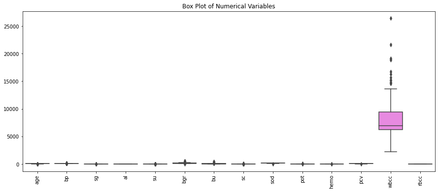
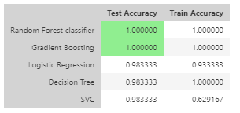

# HDSC-Spring-23-Premier-Project-plotly-group

# Chronic Kidney Disease Prediction

## Introduction

Chronic Kidney Disease (CKD) is a progressive and long-term condition characterized by the gradual loss of kidney function. This project aims to develop a machine learning model that can predict the likelihood of an individual being diagnosed with chronic kidney disease using a provided dataset. By leveraging the power of machine learning algorithms, the goal is to create a predictive model that can assist in early detection and diagnosis of CKD, enabling timely intervention and treatment.

## Problem Statement

Chronic Kidney Disease poses a significant burden on individuals, healthcare systems, and society as a whole. This README file outlines the problem statement, data gathering process, exploratory data analysis, data cleaning and preprocessing steps, model development and evaluation, and model deployment using the Streamlit framework.

## Flow Process

The project follows the following flow process:

*Figure 1: Flow Chart*

## Data Gathering

### Data Gathering Report

The dataset used for this project was obtained from the UCI Machine Learning Repository. The dataset contains information about various attributes or features that are potentially associated with chronic kidney disease. The dataset consists of 400 rows and 25 columns, with each row representing a patient and the columns representing different attributes.

### Dataset Description

The dataset is available at the following link: [Dataset Link](https://archive-beta.ics.uci.edu/dataset/336/chronic+kidney+disease)

The dataset contains 400 rows and 25 columns, including features such as age, blood pressure, specific gravity of urine, albumin in urine, sugar in urine, and more. The target variable indicates the presence or absence of chronic kidney disease. 
This is the cleaned dataset in CSV file. [Cleaned Data in CSV file](https://github-data-bucket.s3.amazonaws.com/chronic_kidney_disease.csv)

### Data Quality and Preprocessing

The dataset was provided in the ARFF format and required preprocessing steps to handle missing values, transform categorical variables, and balance the target variable.

## Exploratory Data Analysis (EDA)

The EDA phase involved analyzing the dataset to gain insights into its structure and relationships between features. Some key findings from the EDA include:

- Target variable distribution: The dataset is imbalanced, with a higher proportion of individuals with chronic kidney disease compared to those without the disease.

*Figure 2: Target Variable Distribution*

- Outliers: Outliers were identified in the white blood cell count variable.

*Figure 3: Outliers*

- Correlation: Certain pairs of features showed strong correlations.

*Figure 4: Correlation*

- Age distribution: The majority of individuals in the dataset fall within the 40-60 years age range.

*Figure 5: Distribution of Age*

- Blood Pressure vs. Glucose: No significant linear relationship was observed between these two variables.

%20vs.%20glucose%20random%20measurement%20(bgr).png)

*Figure 6: Blood Pressure vs. Glucose Random Measurement*

- Serum Creatinine by Hypertension: Individuals with hypertension tend to have higher serum creatinine levels.

%20by%20presence%20of%20hypertension%20(htn).png)

*Figure 7: Serum Creatinine by Presence of Hypertension*

- Pairwise Relationships: The pairplot highlighted potential correlations and patterns between multiple variables.

*Figure 8: Pairwise Relationships between Multiple Variables, Highlighting Different Classes*

- Age Distribution across Classes: Variations in the age distribution were observed across different classes (ckd and notckd).

*Figure 9: Distribution of Age across Different Classes*

- Average Hemoglobin Level: Differences in average hemoglobin levels were observed between the classes.

*Figure 10: Average Hemoglobin Level*

## Data Cleaning and Preprocessing

The data cleaning and preprocessing steps included handling missing values, encoding categorical variables, and performing feature engineering. Some key steps involved:

- Encoding Categorical Variables: Categorical variables were encoded using the LabelEncoder from scikit-learn.
- Feature Engineering: New features such as mean corpuscular volume (MCV), glucose-to-blood pressure ratio, and total blood cell count were created.
- Separating Features and Target Variable: The feature matrix and target variable were separated.
- Balancing the Target Data using Random Undersampling: Random undersampling was performed to balance the classes in the target variable.
- Splitting the Data into Training and Testing Sets: The undersampled data was split into training and testing sets.

## Model Development and Evaluation

Various classification models were trained and evaluated using metrics such as accuracy, precision, recall, and F1-score. The models evaluated included Random Forest Classifier, Gradient Boosting Classifier, Decision Tree Classifier, and Support Vector Classifier. The Random Forest Classifier achieved the highest accuracy with a score of 1.0, making it the recommended model for predicting chronic kidney disease.

*Figure 11: comparing the performance metrics of the evaluated models and Capturing the best model*

### Graphical representation of the model validation results, such as a confusion matrix or ROC curve of the best model (Random Forest).

*Figure 12: Convolution matrix of the model*

True Positives (TP): 29 cases were correctly classified as "ckd."
False Positives (FP): 0 cases were incorrectly classified as "ckd" when they were actually "not ckd."
False Negatives (FN): 0 cases were incorrectly classified as "not ckd" when they were actually "ckd."
True Negatives (TN): 31 cases were correctly classified as "not ckd."

The confusion matrix indicates that the model achieved perfect classification performance, with all cases classified correctly in their 

*Figure 13: ROC Curve*

It indicates that the classification model has achieved optimal performance. This shape L suggests that the model can perfectly distinguish between the two classes.

*Figure 14: Feature Importance*

## Model Deployment

The chronic kidney disease prediction model was deployed using the Streamlit framework. Streamlit provides an interactive web application interface for users to input patient data and obtain predictions. The deployed model achieved a perfect accuracy score of 1.0.

*Figure 15: Interface 1*

*Figure 16: Interface 2*

## Observations:
Age distribution analysis revealed that the majority of individuals in the dataset fall within the 40-60 years age range, indicating the age distribution of patients with chronic kidney disease.
The correlation analysis highlighted strong correlations between certain pairs of features, suggesting potential relationships and dependencies within the dataset.
The box plot analysis showed that individuals with hypertension tend to have higher serum creatinine levels, indicating a potential role of hypertension in kidney function.

## Challenges:
Handling missing values required careful consideration, with imputation or removal strategies applied based on the extent of missingness and data characteristics.
Balancing the imbalanced dataset was a challenge due to a higher proportion of chronic kidney disease instances, requiring the use of undersampling techniques to achieve a more balanced distribution.

## Conclusion
The developed machine learning model and its deployment through Streamlit offer a valuable tool for predicting chronic kidney disease. This project contributes to early detection and intervention for the disease and has the potential to improve patient outcomes. The README provides a comprehensive overview of the project, including data gathering, preprocessing, EDA, model development, and deployment details.

## Repository and Presentation Links

- GitHub Repository: [GitHub Link](https://github.com/krissemmy/HDSC-Spring-23-Premier-Project-plotly-group)
- Presentation Slides: [Slides Link](https://www.canva.com/design/DAFmcKyRcl0/VDi0zTmHzOdGk7BOhm8KYA/edit?utm_content=DAFmcKyRcl0&utm_campaign=designshare&utm_medium=link2&utm_source=sharebutton)

